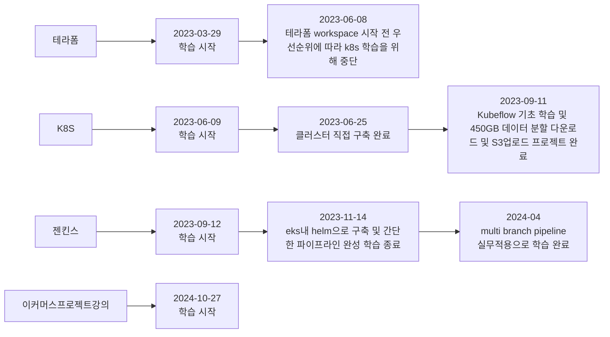

학습 이력 (2024-10-27 갱신)

```mermaid
flowchart LR
    tf0["테라폼"]-->tf1["2023-03-29<br>학습 시작"]-->tf2["2023-06-08<br>테라폼 workspace 시작 전 우선순위에 따라 k8s 학습을 위해 중단"]
    k8s0["K8S"]-->k8s1["2023-06-09<br>학습 시작"]-->k8s2["2023-06-25<br>클러스터 직접 구축 완료"]-->k8s3["2023-09-11<br>Kubeflow 기초 학습 및 450GB 데이터 분할 다운로드 및 S3업로드 프로젝트 완료"]
    jk0["젠킨스"]-->jk1["2023-09-12<br>학습 시작"]-->jk2["2023-11-14<br>eks내 helm으로 구축 및 간단한 파이프라인 완성 학습 종료"]-->jk3["2024-04<br>multi branch pipeline<br>실무적용으로 학습 완료"]
		ep0["이커머스프로젝트강의"]-->ep1["2024-10-27<br>학습 시작"]

```
