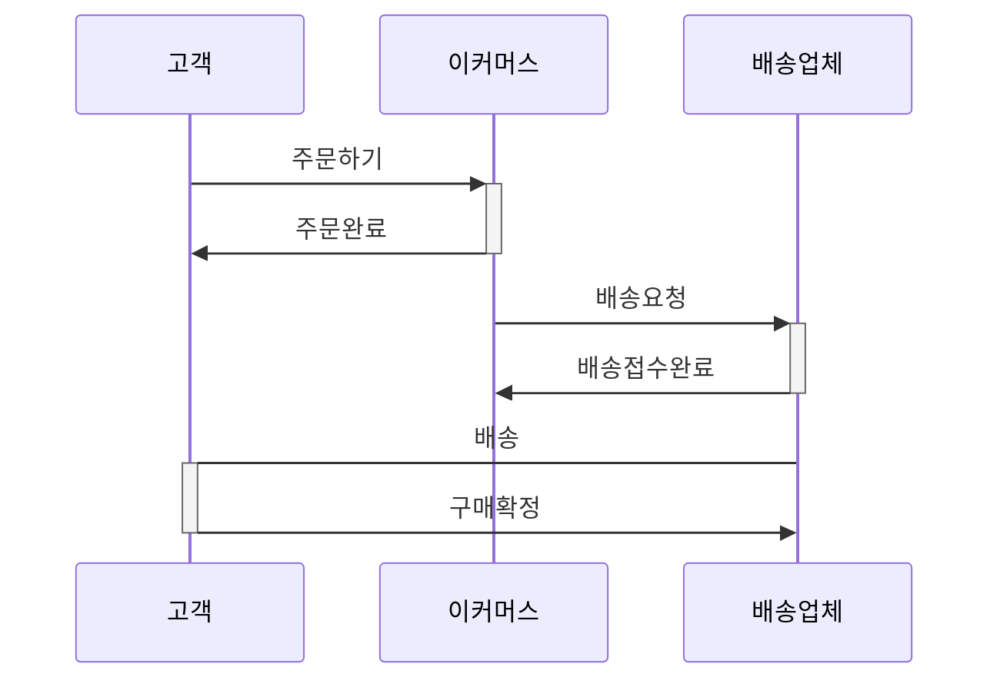
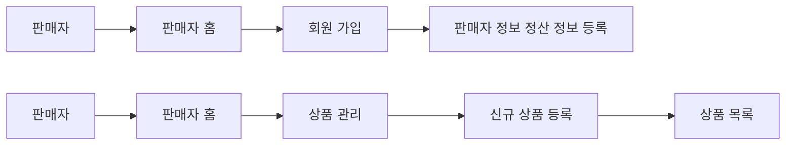
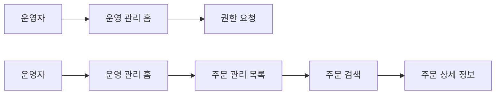
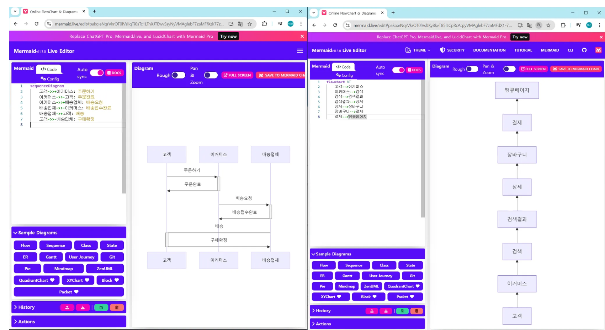
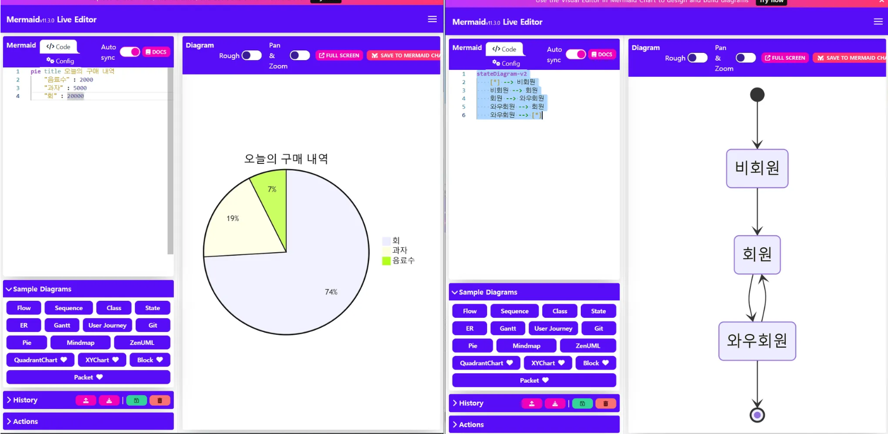
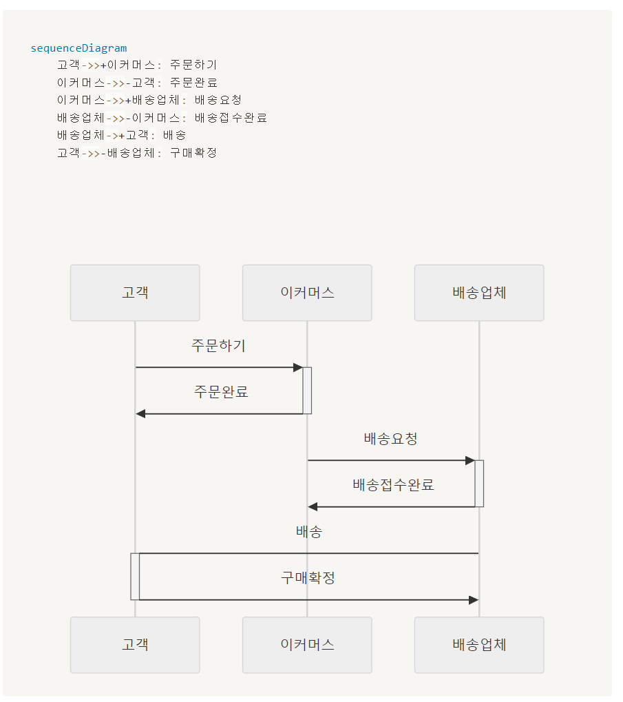
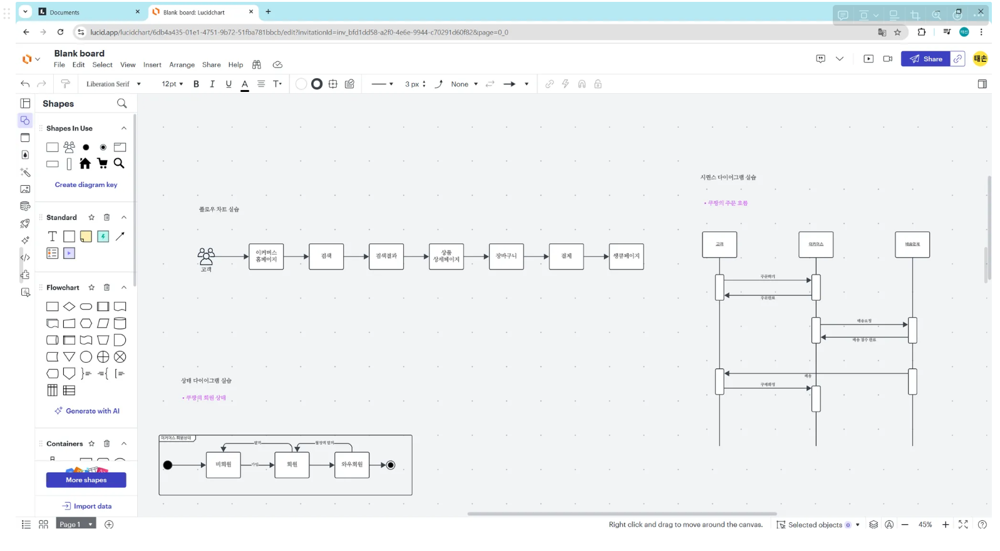
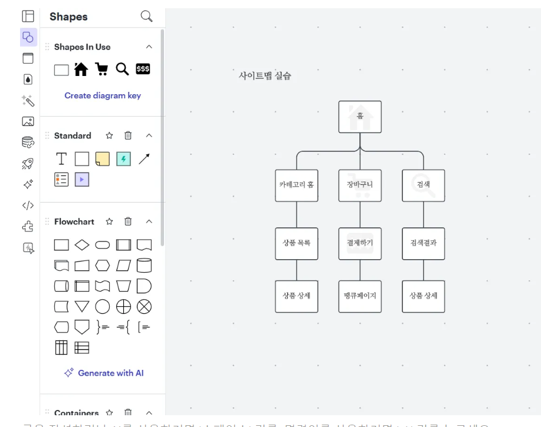

2024-10-27 실습

# Mermaid github

```mermaid
sequenceDiagram
    고객->>+이커머스: 주문하기
    이커머스->>-고객: 주문완료
    이커머스->>+배송업체: 배송요청
    배송업체->>-이커머스: 배송접수완료
    배송업체->+고객: 배송
    고객->>-배송업체: 구매확정
```

```mermaid
flowchart LR
	구매자-->홈페이지
	홈페이지-->검색
	검색-->검색결과
	검색결과-->상세페이지
	상세페이지-->장바구니
	장바구니-->결제
	결제-->완료페이지
```

```mermaid
flowchart LR
	p0["판매자"]-->a["판매자 홈"]-->b["회원 가입"]-->c["판매자 정보 정산 정보 등록"]
	p1["판매자"]-->a1["판매자 홈"]-->b1["상품 관리"]-->c1["신규 상품 등록"]-->d1["상품 목록"]

```

```mermaid
flowchart LR
	u00["운영자"]-->u01["운영 관리 홈"]-->u02["권한 요청"]
	u10["운영자"]-->u11["운영 관리 홈"]-->u12["주문 관리 목록"]-->u13["주문 검색"]-->u14["주문 상세 정보"]

```

# Mermaid live editor

# Mermaid Notion

# Lucid Chart

